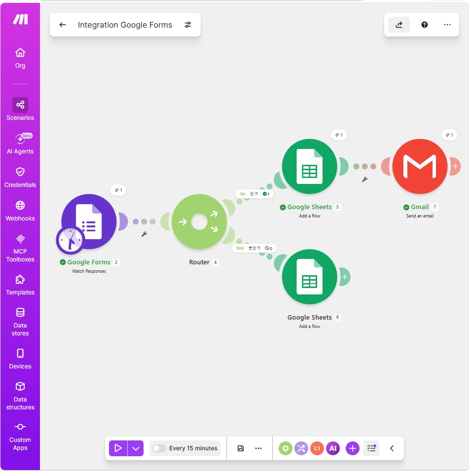

# GenAI 기초 3 (B1-3): 노코드 자동화 기초 — 워크플로우 설계

> 단일 README.md 통합본. [프로젝트 1] 자동화 도구 비교 구현 + [프로젝트 2] 자유 주제 자동화 설계·구현.
> 두 프로젝트 모두 **Make**로 실제 동작하는 시나리오를 구현했으며, [프로젝트 1]은 Zapier 대비 비교 분석을 포함한다.

## 산출물 · 기능요구 대응

| 산출물 | 위치 | 기능요구 |
|---|---|---|
| [프로젝트 1] 자동화 도구 비교 | §P1 + 스크린샷(make·zapier) | 2도구 비교(Make 실구현+Zapier 구조분석) · 동일 워크플로우 · 비교항목 6개 · 장단점 · 적합상황 |
| [프로젝트 2] 자유주제 자동화 | §P2 + 스크린샷(p2) | 업무정의 · 도구선정 이유 · 자동실행(Router 3분기) · 흐름설명 |
| 공통 요건 | 양 프로젝트 | Trigger 1개 · Action 2개 이상(Sheets addRow + Gmail 발송) · 조건분기 1개 이상(Router) · 각 분기경로 1회+ 실행 |
| 보너스 | §보너스 | 미수행(§보너스에 사유·향후 설계안 기록) |

## 스크린샷 (구성 화면 + 실행 결과)

| 도구/단계 | 구성 화면 |
|---|---|
| Make (P1 · 퀴즈 자동채점) |  |
| Zapier (P1 · 비교 구조) | , |
| Make (P2 · 만족도 설문) |  |


---

## [프로젝트 1] 자동화 도구 비교 구현

### 1-1. 프로젝트 개요

**워크플로우**: "Google Forms 코딩 기초 퀴즈 제출 → 점수 자동 판별(80점 기준) → 합격/불합격 시트 분리 기록 → 합격자 이메일 발송"

```
Google Forms 퀴즈 제출(10문항, 자동채점)
        ↓
   [Router] 총점(totalScore) 조건 분기
    ↙ 합격(≥80점)              ↘ 불합격(<80점)
[합격자 시트 기록]                [불합격자 시트 기록]
        ↓
 [Gmail 축하 메일 발송]
```

- **Trigger(1)**: Google Forms 새 응답 감지 (`google-forms:watchResponses`, 대상 폼: "코딩 기초 퀴즈")
- **Action(2종)**: ① Google Sheets 행 추가(`google-sheets:addRow`, 분기별 시트) ② Gmail 메일 발송(`google-email:sendAnEmail`, 합격 분기 전용)
- **조건 분기(1개, Router 2경로)**: `totalScore ≥ 80` → "합격" 경로 / `totalScore < 80` → "불합격" 경로
- **각 분기 실행 확인**: 합격 1건 → 합격자 시트 적재 + 축하 메일 발송, 불합격 1건 → 불합격자 시트 적재(메일 없음) — 스크린샷(make-p1-run)으로 증빙 필요

### 1-2. 사용 도구

| 도구 | 역할 |
|------|------|
| Google Forms | 퀴즈 10문항 제출(문항별 자동 채점 기능 사용) |
| Google Sheets | 합격자 / 불합격자 데이터 분리 저장(스프레드시트 "퀴즈 점수 결과") |
| Gmail | 합격자 대상 자동 축하 메일 발송 |
| **Make** | 위 전체 자동화를 **1개 시나리오**로 구현(실구현) |
| **Zapier** | 동일 워크플로우를 **Zap 2개**로 분리 구현(구조 비교 분석 대상) |

### 1-3. Make 실제 구현 상세 (블루프린트 기준)

| 모듈 | 유형 | 조건/설정 | 출력 |
|---|---|---|---|
| 새 응답 감지 | `google-forms:watchResponses` | 폼: 코딩 기초 퀴즈(ID 마스킹 `1rz5fz…3sl9k`), limit 1 | responseId, totalScore, 문항별 answers |
| Router | `builtin:BasicRouter` | 2개 경로 | — |
| ├ 합격 경로 → 시트 기록 | `google-sheets:addRow` | 필터 "합격": `totalScore ≥ 80` | 시트 "합격자"에 타임스탬프·이메일·점수·Q1~Q10 응답 기록 |
| ├ 합격 경로 → 메일 발송 | `google-email:sendAnEmail` | (합격 경로 내 후속 액션) | 응답자 이메일로 "코딩 기초 퀴즈 합격을 축하합니다." 발송 |
| └ 불합격 경로 → 시트 기록 | `google-sheets:addRow` | 필터 "불합격": `totalScore < 80` | 시트 "불합격자"에 동일 스키마 기록(메일 없음) |

> 비고: 현재 구현은 **합격자에게만 메일이 발송**되고 불합격자에게는 별도 안내가 없다. 필요 시 불합격 경로에도 "재응시 안내" 메일 모듈을 추가해 두 경로의 Action 구성을 대칭화할 수 있다.

### 1-4. Zapier 구조 비교 (설계 기준 비교 분석)

```
[Zap 1 - 합격자용]                [Zap 2 - 불합격자용]
Google Forms Trigger              Google Forms Trigger
        ↓                                  ↓
Filter(80점 이상)                 Filter(80점 미만)
        ↓                                  ↓
Google Sheets(합격자 시트)        Google Sheets(불합격자 시트)
```
> Zapier 무료 플랜은 Zap 1개당 Trigger+Action 2단계만 지원하여, Router에 해당하는 조건 분기를 별도 Zap으로 쪼개야 하고, 이메일 발송(3번째 단계)까지 추가하려면 유료 플랜이 필요하다. 본 비교는 Zapier 무료 플랜의 구조적 제약을 기준으로 한 설계 분석이며, 실제 Zapier 계정에서의 캡처는 스크린샷(zapier-p1-flow/run)으로 별도 증빙이 필요하다.

### 1-5. 비교 분석 보고서 (비교 항목 6개)

| 비교 항목 | Make | Zapier |
|---|---|---|
| ① 무료 플랜 단계 제약 | 제한 없음(1,000 ops/월, 1개 시나리오로 완결) | 무료 플랜은 Zap당 2단계(Trigger+Action)만 지원 → 분기 시 Zap 분리 필요 |
| ② 설정 난이도(UI/UX) | 캔버스형 시각 편집, 전체 흐름을 한눈에 파악 | 목록형 단계 구조, 분기 시 별도 Zap 생성으로 흐름 파악이 어려움 |
| ③ 조건 분기 처리 | Router 1개 모듈 안에서 다경로 통합 관리 | 조건별 Zap을 각각 생성·관리해야 함 |
| ④ 이메일 발송(무료 기준) | 같은 시나리오 내 Gmail 모듈 추가만으로 가능 | 무료 플랜 2단계를 이미 소진해 이메일 Action 추가 시 유료 전환 필요 |
| ⑤ 실행 로그 확인 방식 | 시나리오 실행별 상세 번들(모듈별 입출력 확인 가능) | Zap별 태스크 히스토리(Zap이 분리된 만큼 로그도 분산) |
| ⑥ 확장성 | 조건/기능 추가 시 모듈만 연결하면 됨 | 조건·기능이 늘수록 Zap 수가 함께 증가, 유료 전환 압박 |

- **장단점**: Make는 복잡한 분기·다단계 워크플로우를 1개 시나리오로 완결할 수 있어 학습곡선은 있지만 무료 플랜 내 확장성이 높다. Zapier는 단순 1:1 연결은 빠르지만 분기·다단계 액션이 필요한 순간 Zap 분리·유료 전환이 불가피하다.
- **적합 상황**: 본 퀴즈 자동채점처럼 **조건 분기 + 다단계 액션(시트 기록+메일 발송)**이 함께 필요한 업무는 Make가 적합하다. 반대로 "폼 제출 → 시트 기록"처럼 단일 액션·비개발자 대상 워크플로우는 Zapier의 단순함이 유리하다.

---

## [프로젝트 2] 자유 주제 자동화 설계·구현

### 2-1. 반복 업무 정의

강의 종료 후 매번 수기로 확인하던 **"강의 만족도 설문 결과 확인 및 불만족 응답자 개별 회신"** 업무를 자동화한다. 기존에는 응답을 하나씩 열람해 만족도 등급을 확인하고, 불만족 응답자에게 수동으로 감사·개선 의지 메일을 작성해 보내야 했다.

### 2-2. 선정 도구 및 선정 이유

**선정 도구**: Make

- **비교표 항목③ 조건 분기 처리**: 본 워크플로우는 만족도 등급이 3단계(만족/보통/불만족)로 나뉘어 Router 1개로 3경로를 한 번에 관리할 수 있는 Make가 적합하다. Zapier라면 등급별로 Zap을 3개 만들어야 한다.
- **비교표 항목④ 이메일 발송(무료 기준)**: 불만족 경로에만 개인화된 감사·피드백 메일을 추가로 붙여야 하는데, Make는 무료 플랜에서 같은 시나리오 안에 Gmail 모듈을 추가하는 것만으로 충분하다.

### 2-3. 워크플로우 설계 (다이어그램)

```
[Trigger] Google Forms 새 응답(강의 평가 설문지)
     → [Router] "강의 만족도를 평가해 주세요" 답변 값 기준 3경로 분기
         ├ 만족 (1 매우만족 / 2 만족) → Google Sheets "만족" 시트 기록
         ├ 보통 (텍스트에 "보통" 포함) → Google Sheets "보통" 시트 기록
         └ 불만족 (1 매우불만족 / 2 불만족)
                → Google Sheets "불만족" 시트 기록
                → Gmail 개인화 감사 메일 발송(이름·응답자 이메일 삽입)
```

### 2-4. 구현 상세 (블루프린트 기준)

| 모듈 | 유형 | 조건/설정 | 출력 |
|---|---|---|---|
| 새 응답 감지 | `google-forms:watchResponses` | 폼: 강의 평가 설문지(ID 마스킹 `1CFyL7…3Upc`), limit 1 | 이름, 이메일, 만족도, 의견(선택) 응답 |
| Router | `builtin:BasicRouter` | 3개 경로 | — |
| ├ 만족 → 시트 기록 | `google-sheets:addRow` | 필터 "만족": 만족도 응답 = "1 (매우 만족)" 또는 "2 (만족)" | 시트 "만족"에 타임스탬프·이름·이메일·만족도·의견 기록 |
| ├ 보통 → 시트 기록 | `google-sheets:addRow` | 필터 "보통": 만족도 응답에 "보통" 포함 | 시트 "보통"에 동일 스키마 기록 |
| └ 불만족 → 시트 기록 + 메일 발송 | `google-sheets:addRow` → `google-email:sendAnEmail` | 필터 "불만족": 만족도 응답 = "2 (불만족)" 또는 "1 (매우 불만족)" | 시트 "불만족" 기록 + 응답자 이메일로 "[만족도 조사] 소중한 의견 감사합니다." 개인화 발송 |

### 2-5. 실행 확인

3개 분기(만족/보통/불만족) 각각 최소 1건 이상 실제 응답을 제출해 시트 적재 및 불만족 경로의 메일 발송까지 확인해야 한다(스크린샷 make-p2-run으로 증빙 필요, 본 문서 작성 시점 기준 미첨부).

---

## 과제 목표 대응 (설명형)

### (1) Trigger와 Action의 개념
- **Trigger = 시작점**: 외부 상태 변화를 감지해 워크플로우를 개시한다. 예) "새 Google Form 응답 도착". 스스로는 아무 데이터도 가공하지 않고 흐름을 깨우는 역할만 한다.
- **Action = 처리**: Trigger 이후 실제 작업을 수행한다. 예) "시트에 행 추가", "이메일 발송". Trigger 없이는 실행되지 않는다.
- 비유: Trigger=초인종(눌림 감지), Action=문 열기·손님 안내(후속 처리).

### (2) 조건 분기(Filter/Router)의 역할
- **Filter**: 특정 조건을 만족하는 데이터만 다음 단계로 통과시켜 불필요한 실행을 차단한다(노이즈 제거).
- **Router**: 하나의 입력을 여러 경로로 나눠 서로 다른 후속 Action을 실행하게 한다. 프로젝트1의 "합격/불합격", 프로젝트2의 "만족/보통/불만족"이 이에 해당하며, 각 경로는 프로그래밍의 `if/elif/else` 분기와 대응된다.

### (3) 서로 다른 자동화 도구의 특징 비교
§1-5 비교표(6개 항목) 참고. 핵심 차이는 **무료 플랜에서의 단계 제약**이다. Make는 시나리오당 모듈 수 제한이 사실상 없어 Router·다단계 Action을 하나의 시나리오로 완결할 수 있지만, Zapier 무료 플랜은 Zap당 2단계(Trigger+Action)로 제한되어 분기·다단계 Action이 필요한 순간 Zap을 여러 개로 쪼개야 한다.

### (4) 적합 업무·도구 선택과 이유
- 조건 분기 + 다단계 Action(시트 기록·메일 발송 등)이 함께 필요한 업무(본 프로젝트1·2 모두 해당) → **Make**가 1개 시나리오로 관리 효율이 높아 적합.
- 단일 조건·단일 Action의 단순 연결 업무, 혹은 비개발자가 빠르게 세팅해야 하는 경우 → Zapier의 단순한 목록형 UI가 유리.

### (5) 자동화 흐름의 단계별 설명 (예: 프로젝트2)
| 단계 | 입력 | 출력 |
|---|---|---|
| Trigger(새 응답) | 강의 평가 설문지 제출 이벤트 | 응답 데이터(이름/이메일/만족도/의견) |
| Router | 만족도 응답 값 | 만족/보통/불만족 3경로 중 1개 선택 |
| Google Sheets addRow | 분기별 응답 데이터 | 해당 등급 시트에 행 추가 |
| Gmail(불만족 경로만) | 이름·이메일 | 개인화된 감사 메일 발송 |

---

## 보너스 (수행 여부)

- **보너스 1 – AI 연동 Action**: **미수행**. 현재 두 블루프린트 모두 `google-forms:watchResponses` → `builtin:BasicRouter` → `google-sheets:addRow` / `google-email:sendAnEmail` 모듈로만 구성되어 있으며, ChatGPT/Claude 등 생성형 AI Action은 포함되어 있지 않다.
  - **향후 설계안**: 프로젝트2 "의견을 남겨주세요(선택)" 텍스트 응답을 OpenAI/Claude 모듈로 감정분류(긍정/중립/부정) 또는 1줄 요약해, Router 분기 조건이나 시트 컬럼에 추가하는 방식으로 확장 가능.
- **보너스 2 – 실패 알림 및 재시도 전략**: **미수행**. Error Handler 라우트나 재시도 설정이 블루프린트에 없다.
  - **향후 설계안**: Make 시나리오에 Error Handler 라우트를 추가해 모듈 실패 시 Slack/이메일로 알림(어느 모듈·에러코드 포함), Google Sheets 저장 실패 시 임시 시트에 우선 적재 후 배치 복구, 응답 ID 기준 중복 적재 방지 로직 추가.

---

## 동작 구조 원리 (요약)

- **Trigger-Action 모델**: Trigger(폼 응답 폴링) → Router(조건 분기) → Action 체인(시트 기록/메일 발송). 코드 없이 시각 노드로 이벤트 파이프라인을 구성.
- **분기 동치 설계**: 두 프로젝트 모두 Router의 각 경로에 `filter.conditions`를 두어, 동일 트리거 데이터(`totalScore`, 만족도 응답)를 기준으로 상호 배타적인 경로가 정확히 한 번씩 실행되도록 설계했다.

## 제약 사항 준수 내역

- **구현/동작 제약**: 프로젝트1은 Make(실구현)+Zapier(구조 비교) 2개 도구를 기준으로 동일 워크플로우를 비교했으며, Zapier는 실제 계정 스크린샷이 아직 첨부되지 않아 §1-4의 구조 분석으로 대체되어 있다(§제출 전 실제 Zapier 구현·캡처 보완 필요). 프로젝트2는 Google Forms 응답 제출 시 Trigger가 자동 발화되는 구조로 구현되어 있다.
- **보안/제출물 제약**: 연결 계정 이메일(`01044402345o@gmail.com`)은 본 문서 전체에서 `0104****o@gmail.com` 형태로 마스킹했고, Form ID·Spreadsheet ID도 앞뒤 일부만 노출(`1rz5fz…3sl9k` 등)했다. API Key/토큰은 블루프린트 어디에도 원문 노출되지 않았다(Make 연결(`__IMTCONN__`)은 내부 참조 번호일 뿐 토큰 값이 아님).
- **계정/연동 환경**: Google Sheets + Gmail + Google Forms 조합으로, 가이드라인이 권장하는 저진입장벽 구성(Google Sheets + Email)에 해당한다.
- **과금 리스크**: 두 프로젝트 모두 Make 무료 플랜(모듈 수 제한 없음, 월 1,000 ops) 범위 내에서 완결되며, 유료 결제가 필요한 기능은 사용하지 않았다. Zapier 비교 시에는 무료 플랜의 2단계 제약으로 인해 이메일 발송 Action 추가 시 유료 전환이 불가피함을 §1-4·1-5에 명시했다.
